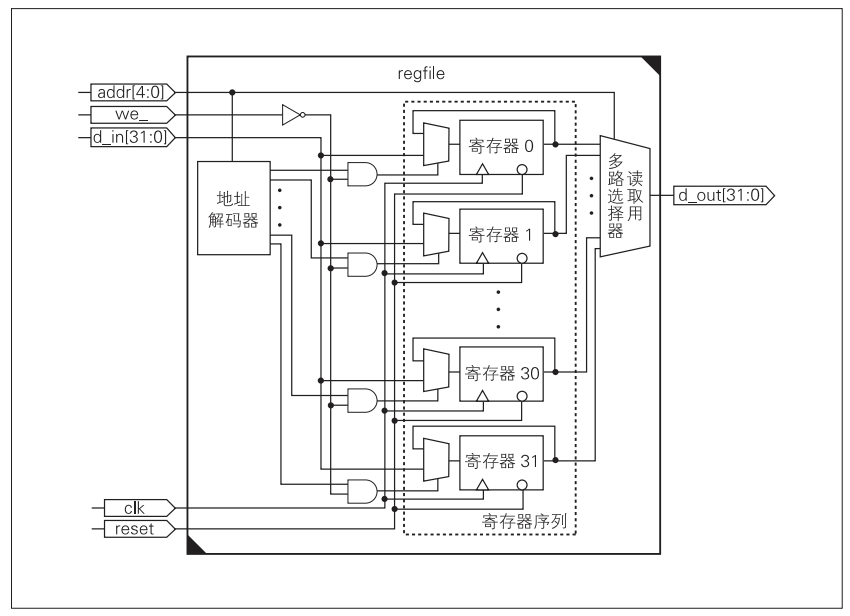
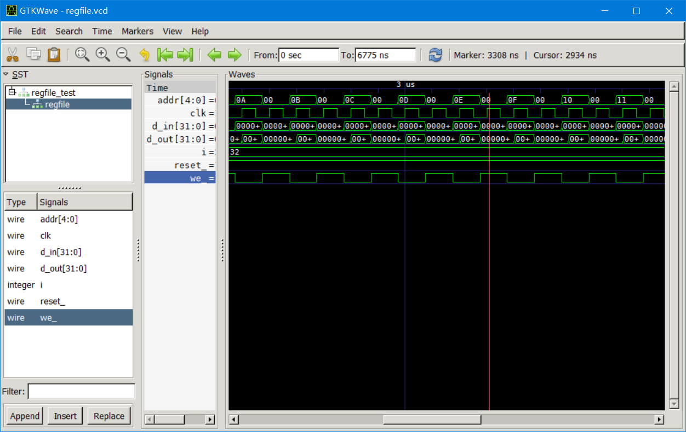

# regHeap-Simulation

## Verilog HDL  

以下内容摘自[Verilog_wiki](https://zh.wikipedia.org/wiki/Verilog)  

> HDL:Hardware-Description-Language,Verilog HDL是一种硬件描述语言，主要用于集成电路设计。  
> Verilog能够在多种抽象级别对数字逻辑系统进行描述：既可以在晶体管级、逻辑门级进行描述，也可以在寄存器传输级对电路信号在寄存器之间的传输情况进行描述。除了对电路的逻辑功能进行描述，Verilog代码还能够被用于逻辑仿真、逻辑综合，其中后者可以把寄存器传输级的Verilog代码转换为逻辑门级的网表，从而方便在现场可编程逻辑门阵列上实现硬件电路，或者让硬件厂商制造具体的专用集成电路。设计人员还可以利用Verilog的扩展部分Verilog-AMS进行模拟电路和混合信号集成电路的设计。

## Description
本项目源于书籍<CPU自制入门>的例程，是学习Verilog的入门基础项目。  
该项目实现了一个32组32位寄存器堆的纯软件实现，并可以通过GTKWave查看仿真波形  

### 寄存器堆框图:  


寄存器堆中有作为存储的32个32位寄存器，以及读写寄存器序列用的接口。寄存器堆模块在regfile.v文件中实现，regfile.v引用了regfile.h头文件。

## Simulation  

Verilog HDL语言同样可以用作电路仿真测试。

### Testbench  

记述仿真程序的文件称为Testbench。  
一个典型的Testbench构造如下:  

```Verilog
`timescale 1ns/1ps  //  设定timescale(单位时间:1ns/时间精度:1ps)

module test_bench;  //  定义Testbench模块。无输入输出端口
    reg adder01_in_0;   //  定义接到被测模块输入输出的信号线
    reg adder01_in_1;   //  输入接寄存器型变量
    wire adder01_cut;   //  输出接网络型变量

    adder adder01 (     //  被测模块的实例化
        .in_0 (adder01_in_0),
        .in_1 (adder01_in_1),
        .out  (adder01_out)
    );

    initial begin       //  记述测试用例
        ...
        ...
        ...
    end

endmodule
```

### Waveform output
仿真时的信号变化可以输出到波形文件中,在此使用多数波形软件都支持的VCD格式波形文件输出方法。  

VCD文件输出使用￥dumpfile和￥dumpvars两个系统任务实现，e.g如下:

```Verilog
$dumpfile(<filename>)
$dumpvars(<Start time>, <Name of the output-waveform file / signal>)

eg:
initial begin 
    $dumpfile("test.vcd");  //Output waveform to file 'test.vcd'
    $dumpvars(0, test);     //Output module 'test' 's waveform from time 0
end
```

## ToolChains
本例程使用Icarus Verilog(iVerilog)进行仿真  
使用GTKWave查看仿真生成的波形文件  
官网:  
- Icarus Verilog: http://iverilog.icarus.com  
- Icarus Verilog for Windows: http://bleyer.org/icarus/
- GTKWave: http://gtkwave.sourceforge.net/

安装及配置环境过程不再阐述  

# Do it!
我使用VsCode编写代码，内置终端非常好用。  
在终端里进入src文件夹，执行以下命令:  

```bash
iverilog -s regfile_test -o regfile_test.out regfile_test.v regfile.v
vvp regfile_test.out
```

Testbench执行后的波形文件输出到了regfile.vcd中。  
执行:  

```bash
vvp regfile.out
```

使用GTKWave查看波形:  

```bash
gtkwave regfile.vcd
```

